# HPS <-> FPGA Data Sharing Cyclone V 

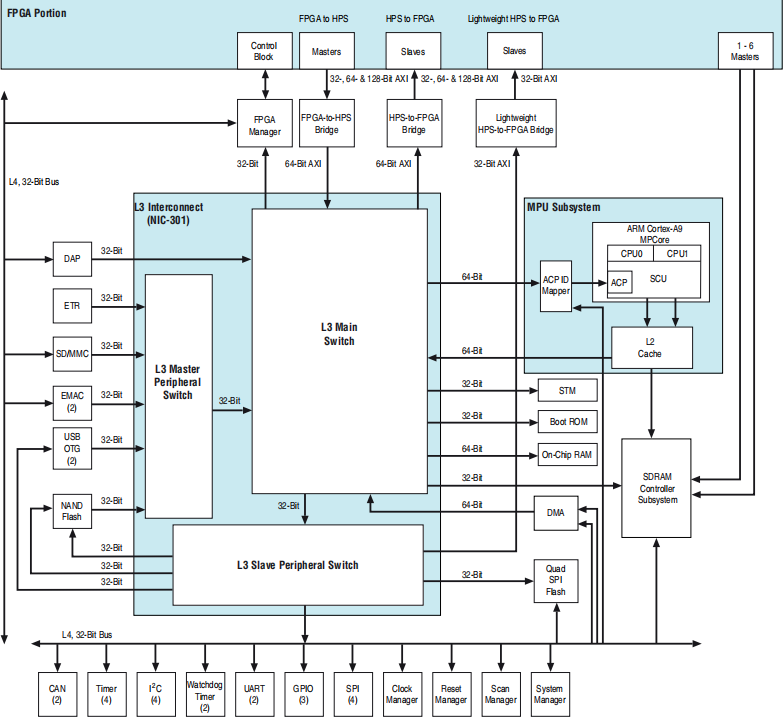

The ARM HPS (Hard Processor System) is has 3 main interfaces to communicate with the FPGA
1. **H2F AXI Bus:** For accessing FPGA peripherals from the HPS. Configurable width: 32, 64, 128 bits. Provides 960 MB of address space.

2. **F2H AXI Bus:** For accessing HPS peripherals from the FPGA. Configuarble width: 32, 64, 128 bits. Provides 960 MB of address space.

3. **F2S AXI / Avalon Bus:** For accessing external DDR SDRAM using the Hard Memory Controller present in the HPS from the FPGA. Supports upto 6 masters with read/write and burst support. Configurable width: 32, 64, 128, 256 bits AXI / Avalon. Provides 4 GB address space all mapped to the DDR SDRAM. 

4. **H2F Lightweight AXI Bus:** 32 bit small AXI bus with low bandwidth. Used to access peripherals in the FPGA from HPS. Its low performance nature makes it suitable for accessing simple CSRs. Provides 2 MB of address space.

# Interfaces Memory Map

The above described buses are accessed through load and store instruction in the HPS because of their memory mapped nature.

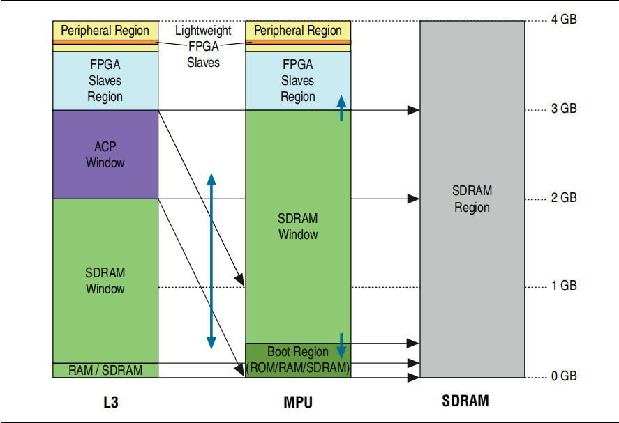

- The FPGA sees the the address space titled "L3" in the above figure when looking through the F2H AXI interface
- The ARM sees the address space titled "MPU" in the above figure. The "FPGA Slaves Region" corresponds to H2F AXI interface addresses. The "Peripheral Region" is the address space of peripherals connected to the L3 and L4 buses. The H2F Lightweight AXI bus is itself a peripheral of the HPS so it's addresses appear in the Peripheral Region
- The ACP (Accelerator Coherency Port) is a 1GB window that accesses the SDRAM through the ARMs L2 Cache. The window is slideable on any Gigabyte aligned boundary.
- The FPGA sees the address space titled "SDRAM" when looking the F2S interfaces. The entire 4GB space is directly mapped to physical SDRAM address space (no virtualization). It is possible to restrict the FPGA accesses to a certain portion by modifying appropriately the *memory protection table* in the CSRs of the SDRAM Controller. The Controller AXI ports support ARM TrustZone protection. Avalon ports are configured for port level protection (whatever that means).

# Accessing SDRAM from the FPGA
DDR SDRAM can be accessed through the following routes
- **F2H (with or without ACP):** Useful for low bandwidth data transfers or cache coherent applications
- **F2S:** Useful for high bandwidth transfers (such as feeding data to an accelerator)


# Example Project: Matrix Multiplication
<!-- TODO: Complete links -->
An example project is provided which feeds a matrix multiplication accelerator with data from the SDRAM. The accelerator is configured for 5x5 16 bit integer matrix multiplication. It has 3 streaming ports (2 16 bit input, 1 32 bit output). The ports are pin compatible with Avalon-ST interface. This guide assumes a Linux based OS with commands run on the `embedded_shell`. The hardware that we will run on is the DE10 Nano. It should be trivial to port it to other SoC boards.

## Step 1: Get Required Files
- The GHRD (Golden Hardware Reference Design) contains a configured project with all the pin assignments and HPS configuration necessary. It also contains a makefile that makes building software easy.

- Accelerator RTL (PeStream.v) (Get it from this link: )


## Step 2: Create a Quartus Project
- Create a directory in which we will work on the project. In this directory create a `hardware` directory. Create a new Quartus project in the hardware named `de10nanoTop`. Select Cyclone V `5CSEBA6U23I7` as the device. The project summary window should match what is shown below:

  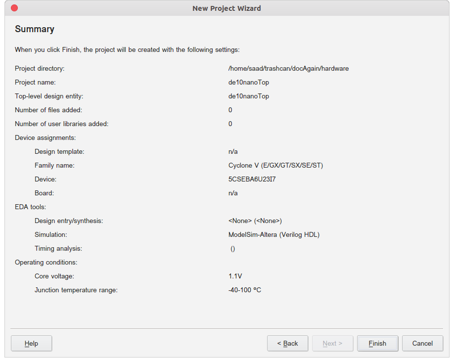

- Copy the accelerator RTL (`PeStream.v`) to the `hardware` directory
- Also copy the `Makefile` and `soc_system.qsys` files to the `hardware` directory. Your directory structure should look like this:
  ```
  .
  ├── db
  ├── de10nanoTop.qpf
  ├── de10nanoTop.qsf
  ├── Makefile
  ├── PeStream.v
  └── soc_system.qsys
  ```

## Step 3: Creating a Qsys Component for the Accelerator
Qsys is used to create and manage interconnections between HPS and FPGA. Hence we must create a Qsys component for our accelerator to be able to connect it with the HPS. 

- Open Qsys from the Quartus window (In newer versions Qsys is renamed to *Platform Designer*). Open `soc_system.qsys` when prompted. You should see the following window

  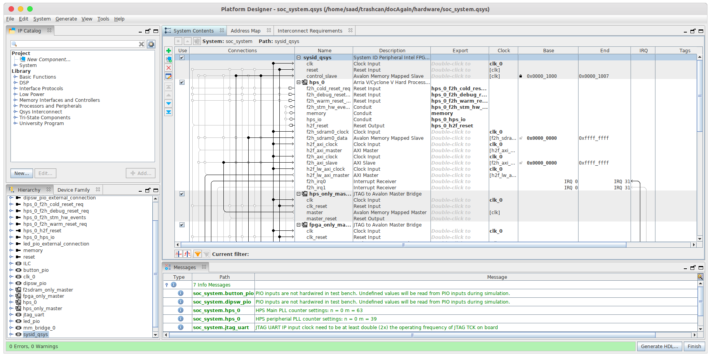
- In the *IP Catalog* tab click on the *New*. In the window that opens, fill the data as shown below

  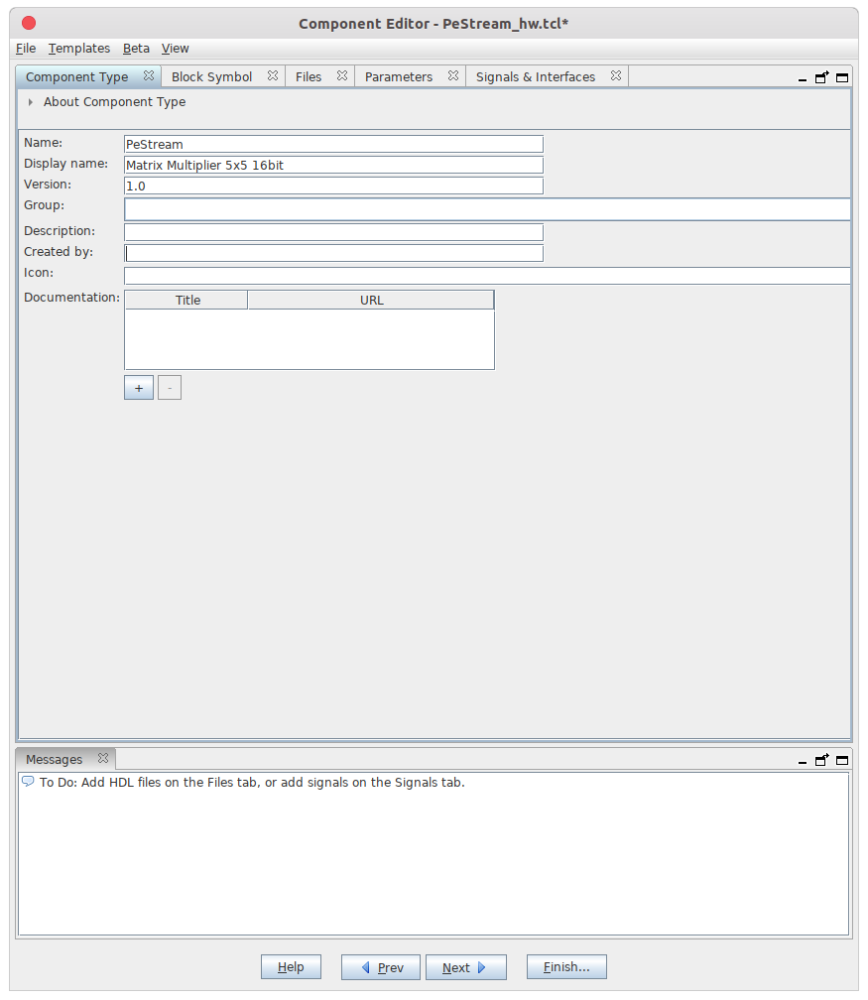

- Next in the *Files* tab add the `PeStream.v` to the synthesis files and click the *Analyze Synthesis Files* button. Then choose `PeStream` as the top level. In the simulation section, click *Copy from Synthesis* button. Your output should match the image shown below

  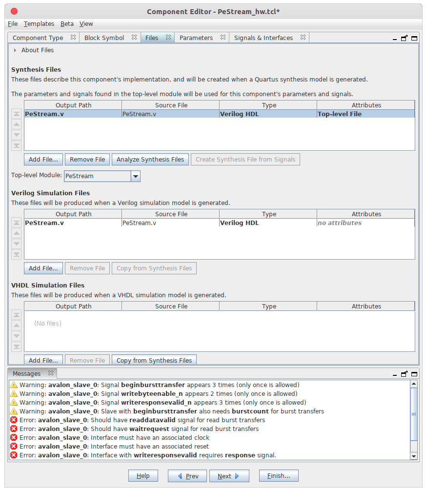

- Next in the *Signals & Interfaces* tab you will assign "roles" to the top level ports of the accelerator. The accelerator has 3 streaming interfaces each with `ready`, `valid` and `payload` signals. These are directly pin compatible with Avalon-ST so now we will tell Qsys about it. In the beginning all the pins would be under a `avalon_slave_0` category as shown in the picture below:
  
  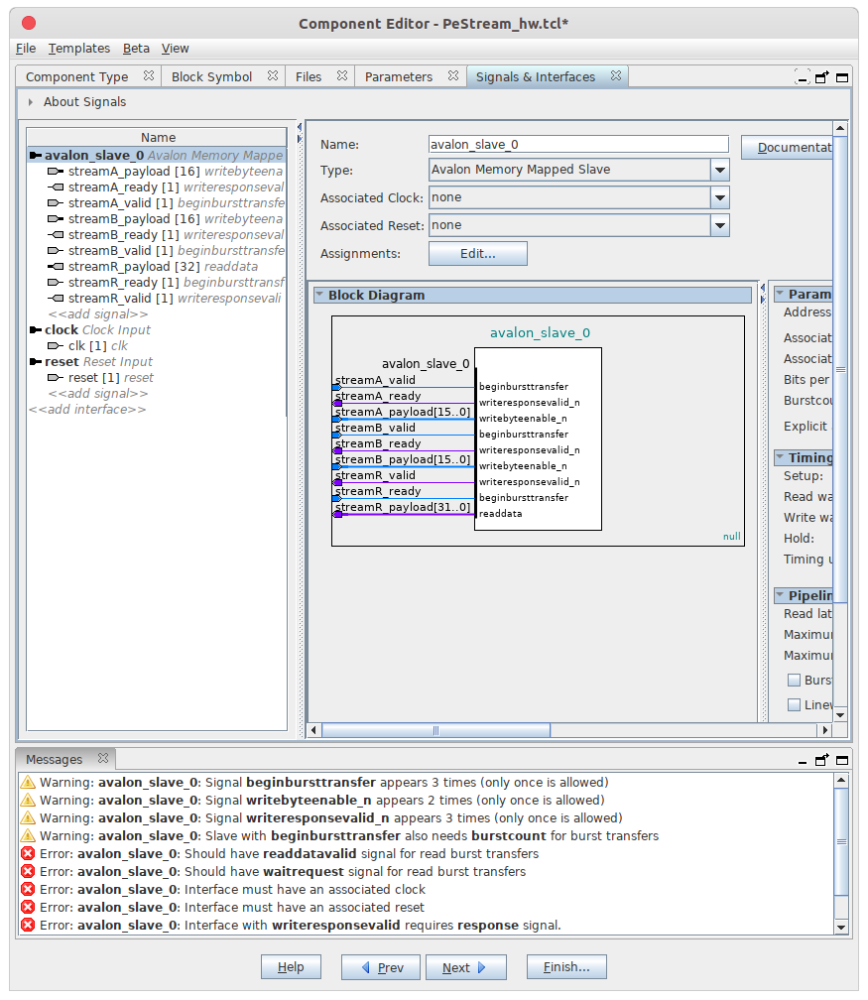

  Create 2 Avalon Streaming Sinks and 1 Avalon Streaming Source by clicking the *<\<add interface>>* label. Name the 2 sinks *streamA* and *streamB* by clicking the interface and pressing `F2` key or editing the *Name* Text box. Name the source *streamR*. Drag and drop the `streamA_*` to streamA, `streamB_*` signals to streamB and `streamR_*` signals to streamR. Delete the now empty `avalon_slave_0` by right click > Remove. Your window should match the picture shown below:

  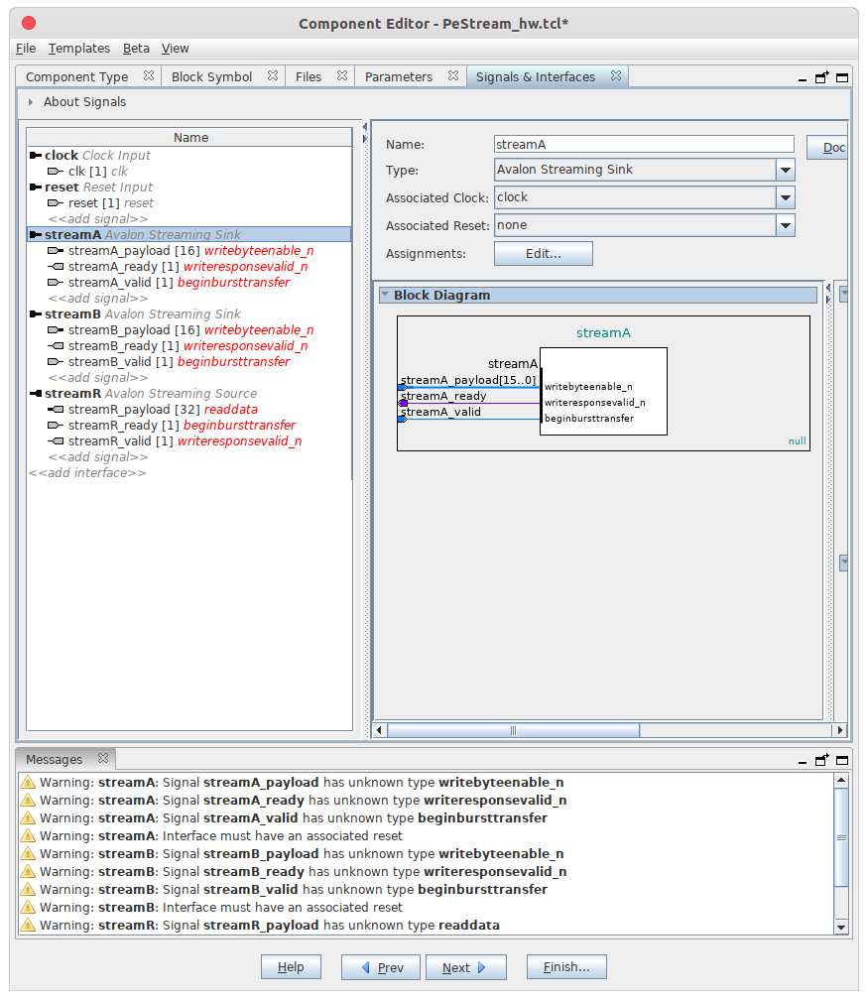

- Now click each streamA interface and set the *Signal Type* of each signal as following shows:
  - `payload` -> `data`
  - `ready` -> `ready`
  - `valid` -> `valid`
  
  Also set the *Assosiated Reset* of each interface to "reset" in the dropdown menu.

  After doing each interface, all the errors and warnings should disappear and your window should match the image shown below:

  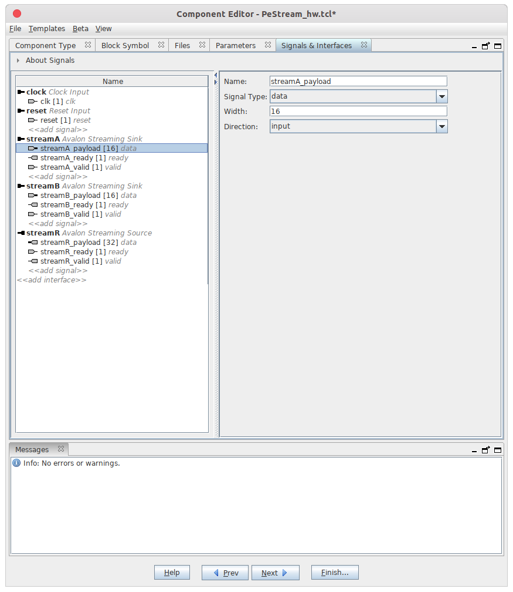

- Click Finish and save to complete the process. Now the accelerator should show up as an IP in the *IP Catalog*.

  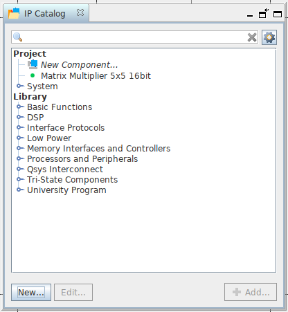

- This process will create a file named `PeStream_hw.tcl` in the `hardware` directory. This TCL file is what Qsys uses to identify custom components

## Step 4: Cleaning up the Qsys System
Remove the *JTAG to Avalon Master* peripherals and "minimize" everything except the `hps` and `clk`. This helps to reduce the clutter on the screen. Your screen should look like the one below:

  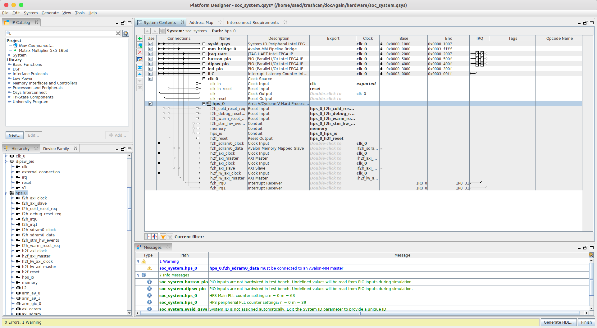

## Step 5: Configuring HPS Interfaces
Since our goal is to use SDRAM as the data storage location, we will enable 3 F2S interfaces. 2 of them for read only and 1 of them for write only. We will use Avalon Bus.

- Double click the HPS to open parameters window
- Edit the *AXI Bridges* and *FPGA-HPS SDRAM Interface* sections to match what is shown in the following picture

  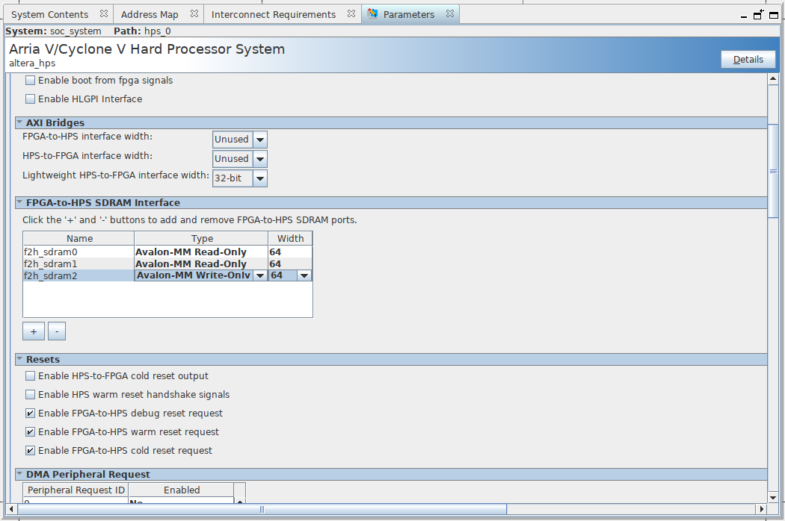

- Back in Qsys click System > Remove Dangling Connections

## Step 6: Adding Accelerator and DMAs
We will store the matrices in DDR memory and use a DMA to stream the data to and from the accelerator. The Altera mSGDMA (modular Scatter Gather DMA) will be used for the task as it can read from memory and streams. It also supports bursting and request queues. We need 3 DMAs; one for each Avalon interface of the accelerator. We will control the DMAs using the HPS Lightweight AXI interface. 

- Search for `msgdma` in the IP Catalog and add it

  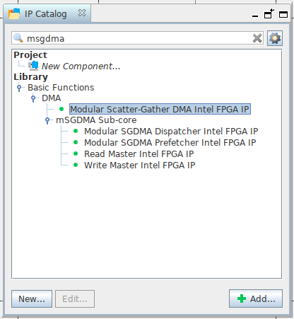

- Since the two sinks in the accelerator take 16 bit data, we should configure the DMA appropriately. Set the options as shown in the picture below. Only change the settings in the *DMA Settings* section of the dialog.

  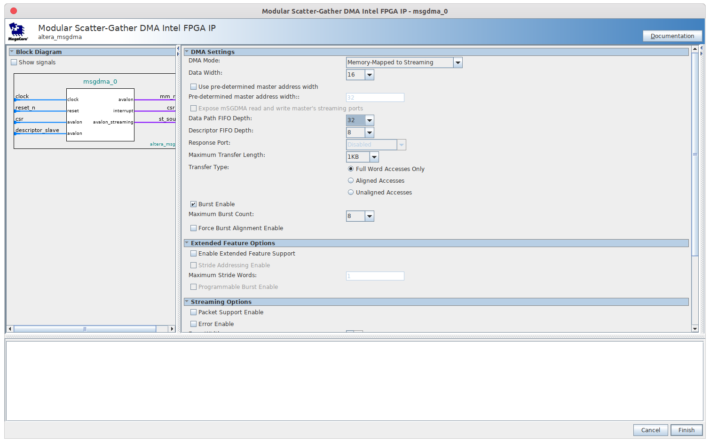

- Once it has been added, right click it and click *Duplicate* to create another with the same config. Rename them to "streamA_DMA" and "streamB_DMA".
- Duplicate one of the DMAs again and modify it appropriately for the streaming source of the acclerator. Name it "streamR_DMA". The settings are shown in the picture below

  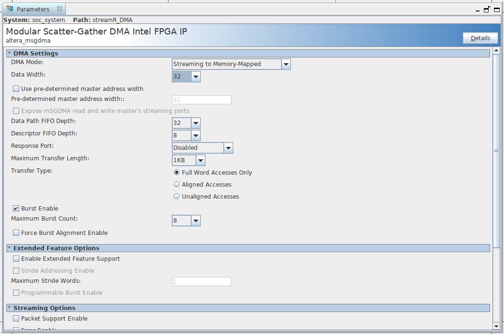

- Now the Qsys system should look something like this:

  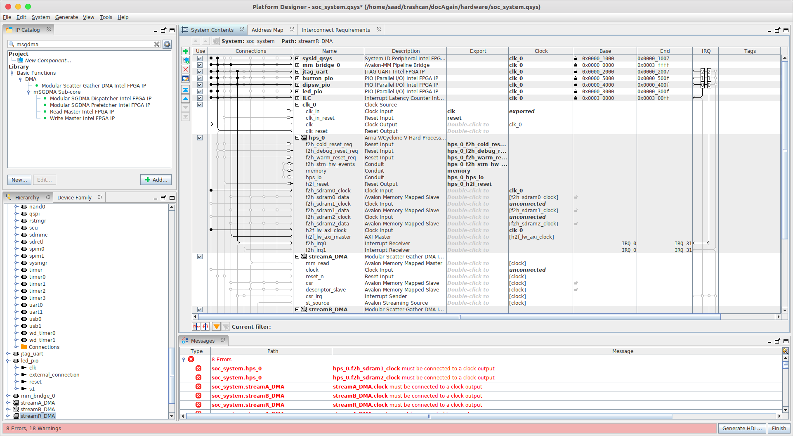

## Step 7: Connecting with HPS
- Connect all the missing `clock` and `reset` ports with the `clock` and `reset` lines of the clock component. After this all errors should disappear and only warnings should be left.

- Connect the `csr` and `descriptor_slave` ports of each DMA to the H2F Lightweight AXI bus. These are the interfaces used to control the DMAs. Then click System > Assign Base Addresses. If an error appears that says `Error: soc_system.hps_0.h2f_lw_axi_master: streamR_DMA.csr (0x1000000..0x100001f) is outside the master's address range (0x0..0x1fffff)` then edit the streamA_DMA's CSR base address by double clicking the relevant column to `0x0004_0040` and click the lock to lock this address. Then click System > Assign Base Addresses again. This should fix the errors. If it doesn't you'll have to manually provide the addresses and lock them. The system should look like this

  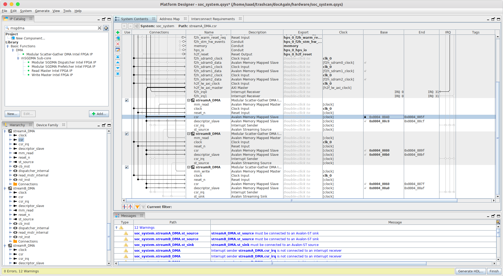

- Now connect the streamA and streamB DMAs `mm_read` port to the `f2h_sdram` ports on the HPS. `f2h_sdram0` and `f2h_sdram1` are the read only ports so we connect them to it. 
- Connect `mm_write` port of streamR DMA to `f2h_sdram2` write only port.
- Now the system should look like below:

  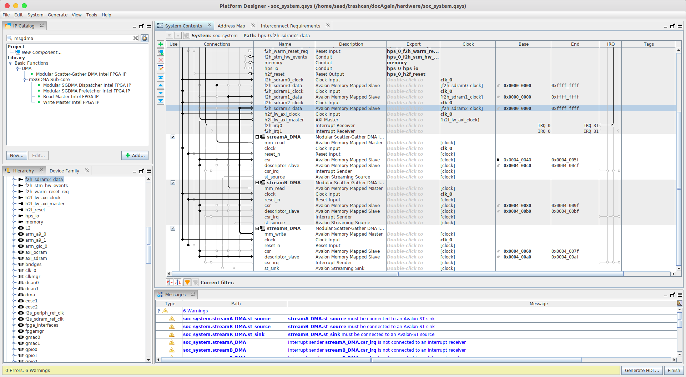

## Step 8: Adding the accelerator
- Finally add the accelerator to the system
- Connect the st-source and sinks from the DMAs to the corresponding ports in the accelerator. The system should look like as shown in the picture

  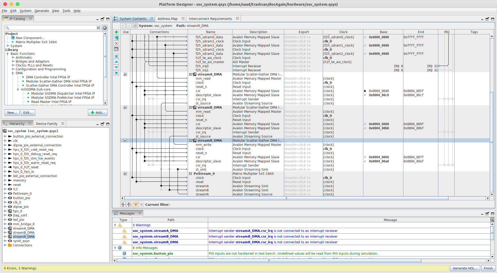

  We will not be connecting the DMA interrupts for now

## Step 9: Finalizing
- Save the system and click the Generate Button
- Uncheck *Create Block Symbol File* option and click Generate

## Step 10: Creating a Top Level Module 
The generate step created the RTL files in the `soc_system` directory. Now we must instantiate the component in our top level component. 

- Create a new verilog file in Quartus named `de10nanoTop.v`
- Add the following code to it:
  ```Verilog
  //=======================================================
  //  This code is generated by Terasic System Builder
  //=======================================================

  module de10nanoTop(

      //////////// CLOCK //////////
      input               FPGA_CLK1_50,
      input               FPGA_CLK2_50,
      input               FPGA_CLK3_50,

      //////////// HDMI //////////
      inout               HDMI_I2C_SCL,
      inout               HDMI_I2C_SDA,
      inout               HDMI_I2S,
      inout               HDMI_LRCLK,
      inout               HDMI_MCLK,
      inout               HDMI_SCLK,
      output              HDMI_TX_CLK,
      output   [23: 0]    HDMI_TX_D,
      output              HDMI_TX_DE,
      output              HDMI_TX_HS,
      input               HDMI_TX_INT,
      output              HDMI_TX_VS,

      //////////// HPS //////////
      inout               HPS_CONV_USB_N,
      output   [14: 0]    HPS_DDR3_ADDR,
      output   [ 2: 0]    HPS_DDR3_BA,
      output              HPS_DDR3_CAS_N,
      output              HPS_DDR3_CK_N,
      output              HPS_DDR3_CK_P,
      output              HPS_DDR3_CKE,
      output              HPS_DDR3_CS_N,
      output   [ 3: 0]    HPS_DDR3_DM,
      inout    [31: 0]    HPS_DDR3_DQ,
      inout    [ 3: 0]    HPS_DDR3_DQS_N,
      inout    [ 3: 0]    HPS_DDR3_DQS_P,
      output              HPS_DDR3_ODT,
      output              HPS_DDR3_RAS_N,
      output              HPS_DDR3_RESET_N,
      input               HPS_DDR3_RZQ,
      output              HPS_DDR3_WE_N,
      output              HPS_ENET_GTX_CLK,
      inout               HPS_ENET_INT_N,
      output              HPS_ENET_MDC,
      inout               HPS_ENET_MDIO,
      input               HPS_ENET_RX_CLK,
      input    [ 3: 0]    HPS_ENET_RX_DATA,
      input               HPS_ENET_RX_DV,
      output   [ 3: 0]    HPS_ENET_TX_DATA,
      output              HPS_ENET_TX_EN,
      inout               HPS_GSENSOR_INT,
      inout               HPS_I2C0_SCLK,
      inout               HPS_I2C0_SDAT,
      inout               HPS_I2C1_SCLK,
      inout               HPS_I2C1_SDAT,
      inout               HPS_KEY,
      inout               HPS_LED,
      inout               HPS_LTC_GPIO,
      output              HPS_SD_CLK,
      inout               HPS_SD_CMD,
      inout    [ 3: 0]    HPS_SD_DATA,
      output              HPS_SPIM_CLK,
      input               HPS_SPIM_MISO,
      output              HPS_SPIM_MOSI,
      inout               HPS_SPIM_SS,
      input               HPS_UART_RX,
      output              HPS_UART_TX,
      input               HPS_USB_CLKOUT,
      inout    [ 7: 0]    HPS_USB_DATA,
      input               HPS_USB_DIR,
      input               HPS_USB_NXT,
      output              HPS_USB_STP,

      //////////// KEY //////////
      input    [ 1: 0]    KEY,

      //////////// LED //////////
      output   [ 7: 0]    LED,

      //////////// SW //////////
      input    [ 3: 0]    SW
  );
    soc_system u0(
    //Clock&Reset
    .clk_clk(FPGA_CLK1_50),                                      //                            clk.clk
    .reset_reset_n(KEY[0]),                            					 //                          reset.reset_n
    //HPS ddr3
    .memory_mem_a(HPS_DDR3_ADDR),                                //                         memory.mem_a
    .memory_mem_ba(HPS_DDR3_BA),                                 //                               .mem_ba
    .memory_mem_ck(HPS_DDR3_CK_P),                               //                               .mem_ck
    .memory_mem_ck_n(HPS_DDR3_CK_N),                             //                               .mem_ck_n
    .memory_mem_cke(HPS_DDR3_CKE),                               //                               .mem_cke
    .memory_mem_cs_n(HPS_DDR3_CS_N),                             //                               .mem_cs_n
    .memory_mem_ras_n(HPS_DDR3_RAS_N),                           //                               .mem_ras_n
    .memory_mem_cas_n(HPS_DDR3_CAS_N),                           //                               .mem_cas_n
    .memory_mem_we_n(HPS_DDR3_WE_N),                             //                               .mem_we_n
    .memory_mem_reset_n(HPS_DDR3_RESET_N),                       //                               .mem_reset_n
    .memory_mem_dq(HPS_DDR3_DQ),                                 //                               .mem_dq
    .memory_mem_dqs(HPS_DDR3_DQS_P),                             //                               .mem_dqs
    .memory_mem_dqs_n(HPS_DDR3_DQS_N),                           //                               .mem_dqs_n
    .memory_mem_odt(HPS_DDR3_ODT),                               //                               .mem_odt
    .memory_mem_dm(HPS_DDR3_DM),                                 //                               .mem_dm
    .memory_oct_rzqin(HPS_DDR3_RZQ),                             //                               .oct_rzqin
    //HPS ethernet
    .hps_0_hps_io_hps_io_emac1_inst_TX_CLK(HPS_ENET_GTX_CLK),    //                   hps_0_hps_io.hps_io_emac1_inst_TX_CLK
    .hps_0_hps_io_hps_io_emac1_inst_TXD0(HPS_ENET_TX_DATA[0]),   //                               .hps_io_emac1_inst_TXD0
    .hps_0_hps_io_hps_io_emac1_inst_TXD1(HPS_ENET_TX_DATA[1]),   //                               .hps_io_emac1_inst_TXD1
    .hps_0_hps_io_hps_io_emac1_inst_TXD2(HPS_ENET_TX_DATA[2]),   //                               .hps_io_emac1_inst_TXD2
    .hps_0_hps_io_hps_io_emac1_inst_TXD3(HPS_ENET_TX_DATA[3]),   //                               .hps_io_emac1_inst_TXD3
    .hps_0_hps_io_hps_io_emac1_inst_RXD0(HPS_ENET_RX_DATA[0]),   //                               .hps_io_emac1_inst_RXD0
    .hps_0_hps_io_hps_io_emac1_inst_MDIO(HPS_ENET_MDIO),         //                               .hps_io_emac1_inst_MDIO
    .hps_0_hps_io_hps_io_emac1_inst_MDC(HPS_ENET_MDC),           //                               .hps_io_emac1_inst_MDC
    .hps_0_hps_io_hps_io_emac1_inst_RX_CTL(HPS_ENET_RX_DV),      //                               .hps_io_emac1_inst_RX_CTL
    .hps_0_hps_io_hps_io_emac1_inst_TX_CTL(HPS_ENET_TX_EN),      //                               .hps_io_emac1_inst_TX_CTL
    .hps_0_hps_io_hps_io_emac1_inst_RX_CLK(HPS_ENET_RX_CLK),     //                               .hps_io_emac1_inst_RX_CLK
    .hps_0_hps_io_hps_io_emac1_inst_RXD1(HPS_ENET_RX_DATA[1]),   //                               .hps_io_emac1_inst_RXD1
    .hps_0_hps_io_hps_io_emac1_inst_RXD2(HPS_ENET_RX_DATA[2]),   //                               .hps_io_emac1_inst_RXD2
    .hps_0_hps_io_hps_io_emac1_inst_RXD3(HPS_ENET_RX_DATA[3]),   //                               .hps_io_emac1_inst_RXD3
    //HPS SD card
    .hps_0_hps_io_hps_io_sdio_inst_CMD(HPS_SD_CMD),              //                               .hps_io_sdio_inst_CMD
    .hps_0_hps_io_hps_io_sdio_inst_D0(HPS_SD_DATA[0]),           //                               .hps_io_sdio_inst_D0
    .hps_0_hps_io_hps_io_sdio_inst_D1(HPS_SD_DATA[1]),           //                               .hps_io_sdio_inst_D1
    .hps_0_hps_io_hps_io_sdio_inst_CLK(HPS_SD_CLK),              //                               .hps_io_sdio_inst_CLK
    .hps_0_hps_io_hps_io_sdio_inst_D2(HPS_SD_DATA[2]),           //                               .hps_io_sdio_inst_D2
    .hps_0_hps_io_hps_io_sdio_inst_D3(HPS_SD_DATA[3]),           //                               .hps_io_sdio_inst_D3
    //HPS USB
    .hps_0_hps_io_hps_io_usb1_inst_D0(HPS_USB_DATA[0]),          //                               .hps_io_usb1_inst_D0
    .hps_0_hps_io_hps_io_usb1_inst_D1(HPS_USB_DATA[1]),          //                               .hps_io_usb1_inst_D1
    .hps_0_hps_io_hps_io_usb1_inst_D2(HPS_USB_DATA[2]),          //                               .hps_io_usb1_inst_D2
    .hps_0_hps_io_hps_io_usb1_inst_D3(HPS_USB_DATA[3]),          //                               .hps_io_usb1_inst_D3
    .hps_0_hps_io_hps_io_usb1_inst_D4(HPS_USB_DATA[4]),          //                               .hps_io_usb1_inst_D4
    .hps_0_hps_io_hps_io_usb1_inst_D5(HPS_USB_DATA[5]),          //                               .hps_io_usb1_inst_D5
    .hps_0_hps_io_hps_io_usb1_inst_D6(HPS_USB_DATA[6]),          //                               .hps_io_usb1_inst_D6
    .hps_0_hps_io_hps_io_usb1_inst_D7(HPS_USB_DATA[7]),          //                               .hps_io_usb1_inst_D7
    .hps_0_hps_io_hps_io_usb1_inst_CLK(HPS_USB_CLKOUT),          //                               .hps_io_usb1_inst_CLK
    .hps_0_hps_io_hps_io_usb1_inst_STP(HPS_USB_STP),             //                               .hps_io_usb1_inst_STP
    .hps_0_hps_io_hps_io_usb1_inst_DIR(HPS_USB_DIR),             //                               .hps_io_usb1_inst_DIR
    .hps_0_hps_io_hps_io_usb1_inst_NXT(HPS_USB_NXT),             //                               .hps_io_usb1_inst_NXT
    //HPS SPI
    .hps_0_hps_io_hps_io_spim1_inst_CLK(HPS_SPIM_CLK),           //                               .hps_io_spim1_inst_CLK
    .hps_0_hps_io_hps_io_spim1_inst_MOSI(HPS_SPIM_MOSI),         //                               .hps_io_spim1_inst_MOSI
    .hps_0_hps_io_hps_io_spim1_inst_MISO(HPS_SPIM_MISO),         //                               .hps_io_spim1_inst_MISO
    .hps_0_hps_io_hps_io_spim1_inst_SS0(HPS_SPIM_SS),            //                               .hps_io_spim1_inst_SS0
    //HPS UART
    .hps_0_hps_io_hps_io_uart0_inst_RX(HPS_UART_RX),             //                               .hps_io_uart0_inst_RX
    .hps_0_hps_io_hps_io_uart0_inst_TX(HPS_UART_TX),             //                               .hps_io_uart0_inst_TX
    //HPS I2C1
    .hps_0_hps_io_hps_io_i2c0_inst_SDA(HPS_I2C0_SDAT),           //                               .hps_io_i2c0_inst_SDA
    .hps_0_hps_io_hps_io_i2c0_inst_SCL(HPS_I2C0_SCLK),           //                               .hps_io_i2c0_inst_SCL
    //HPS I2C2
    .hps_0_hps_io_hps_io_i2c1_inst_SDA(HPS_I2C1_SDAT),           //                               .hps_io_i2c1_inst_SDA
    .hps_0_hps_io_hps_io_i2c1_inst_SCL(HPS_I2C1_SCLK),           //                               .hps_io_i2c1_inst_SCL
    //GPIO
    .hps_0_hps_io_hps_io_gpio_inst_GPIO09(HPS_CONV_USB_N),       //                               .hps_io_gpio_inst_GPIO09
    .hps_0_hps_io_hps_io_gpio_inst_GPIO35(HPS_ENET_INT_N),       //                               .hps_io_gpio_inst_GPIO35
    .hps_0_hps_io_hps_io_gpio_inst_GPIO40(HPS_LTC_GPIO),         //                               .hps_io_gpio_inst_GPIO40
    .hps_0_hps_io_hps_io_gpio_inst_GPIO53(HPS_LED),              //                               .hps_io_gpio_inst_GPIO53
    .hps_0_hps_io_hps_io_gpio_inst_GPIO54(HPS_KEY),              //                               .hps_io_gpio_inst_GPIO54
    .hps_0_hps_io_hps_io_gpio_inst_GPIO61(HPS_GSENSOR_INT),      //                               .hps_io_gpio_inst_GPIO61
    //FPGA Partion
    .led_pio_external_connection_export(LED[6:0]),      				 //    led_pio_external_connection.export
    .dipsw_pio_external_connection_export(SW),                   //  dipsw_pio_external_connection.export
    .button_pio_external_connection_export(KEY)
  );
  endmodule
  ```
- In the top level module we just instantiate the qsys component. It has a lot of ports to connect to various hard peripherals on the hps (ddr, usb, uart, ethernet etc)
- Next in quartus, go to Project > Add/Remove Files in Project
- Add the Qsys generated ip to the project (`soc_system/synthesis/soc_system.qip`)
  
  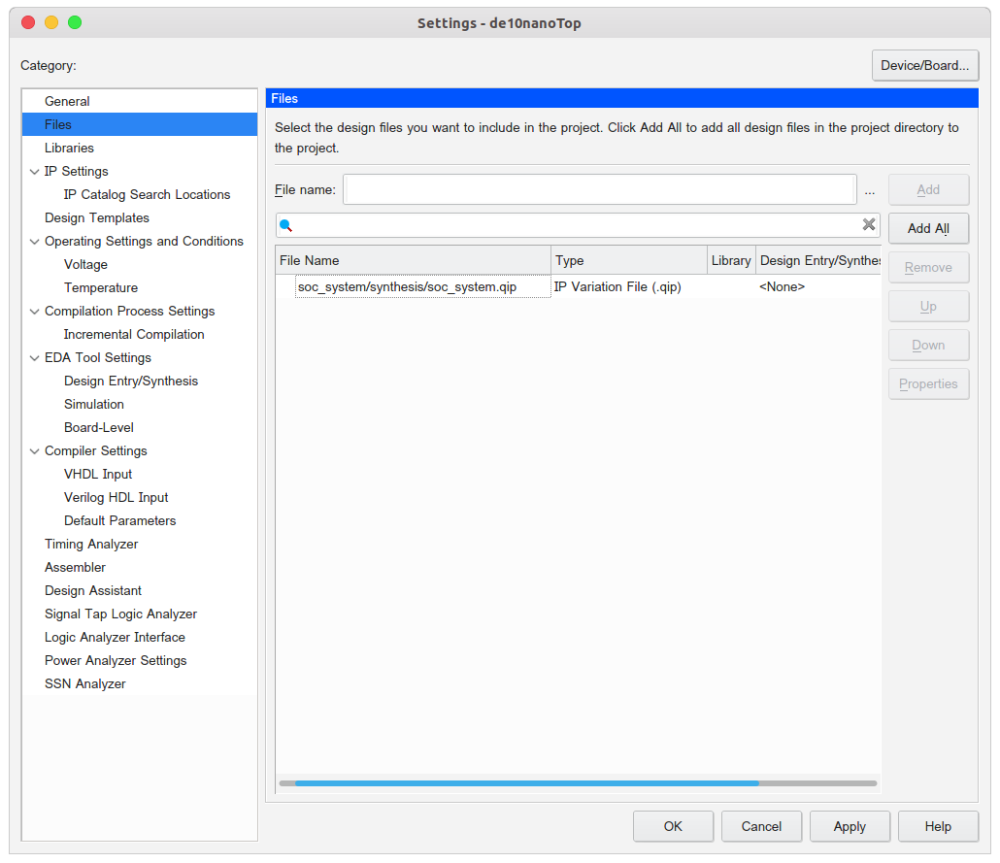

## Step 11: Adding Pin Assignments
In an HPS project, only the pin assignments of the pins that are attached to the FPGA (clocks, leds etc) are required. HPS pins (ddr, ethernet, usb etc) are fixed and the fitter places them automatically. However voltage levels for HPS pins are required. The pin assignments can be added manually through pin planner or can be copied directly to the settings file. 

- In an editor open `de10nanoTop.qsf` 
- In the file add the following lines at the end
  ```TCL
  #============================================================
  # CLOCK
  #============================================================
  set_instance_assignment -name IO_STANDARD "3.3-V LVTTL" -to FPGA_CLK1_50
  set_instance_assignment -name IO_STANDARD "3.3-V LVTTL" -to FPGA_CLK2_50
  set_instance_assignment -name IO_STANDARD "3.3-V LVTTL" -to FPGA_CLK3_50
  set_location_assignment PIN_V11 -to FPGA_CLK1_50
  set_location_assignment PIN_Y13 -to FPGA_CLK2_50
  set_location_assignment PIN_E11 -to FPGA_CLK3_50

  #============================================================
  # HDMI
  #============================================================
  set_instance_assignment -name IO_STANDARD "3.3-V LVTTL" -to HDMI_I2C_SCL
  set_instance_assignment -name IO_STANDARD "3.3-V LVTTL" -to HDMI_I2C_SDA
  set_instance_assignment -name IO_STANDARD "3.3-V LVTTL" -to HDMI_I2S
  set_instance_assignment -name IO_STANDARD "3.3-V LVTTL" -to HDMI_LRCLK
  set_instance_assignment -name IO_STANDARD "3.3-V LVTTL" -to HDMI_MCLK
  set_instance_assignment -name IO_STANDARD "3.3-V LVTTL" -to HDMI_SCLK
  set_instance_assignment -name IO_STANDARD "3.3-V LVTTL" -to HDMI_TX_CLK
  set_instance_assignment -name IO_STANDARD "3.3-V LVTTL" -to HDMI_TX_DE
  set_instance_assignment -name IO_STANDARD "3.3-V LVTTL" -to HDMI_TX_D[0]
  set_instance_assignment -name IO_STANDARD "3.3-V LVTTL" -to HDMI_TX_D[1]
  set_instance_assignment -name IO_STANDARD "3.3-V LVTTL" -to HDMI_TX_D[2]
  set_instance_assignment -name IO_STANDARD "3.3-V LVTTL" -to HDMI_TX_D[3]
  set_instance_assignment -name IO_STANDARD "3.3-V LVTTL" -to HDMI_TX_D[4]
  set_instance_assignment -name IO_STANDARD "3.3-V LVTTL" -to HDMI_TX_D[5]
  set_instance_assignment -name IO_STANDARD "3.3-V LVTTL" -to HDMI_TX_D[6]
  set_instance_assignment -name IO_STANDARD "3.3-V LVTTL" -to HDMI_TX_D[7]
  set_instance_assignment -name IO_STANDARD "3.3-V LVTTL" -to HDMI_TX_D[8]
  set_instance_assignment -name IO_STANDARD "3.3-V LVTTL" -to HDMI_TX_D[9]
  set_instance_assignment -name IO_STANDARD "3.3-V LVTTL" -to HDMI_TX_D[10]
  set_instance_assignment -name IO_STANDARD "3.3-V LVTTL" -to HDMI_TX_D[11]
  set_instance_assignment -name IO_STANDARD "3.3-V LVTTL" -to HDMI_TX_D[12]
  set_instance_assignment -name IO_STANDARD "3.3-V LVTTL" -to HDMI_TX_D[13]
  set_instance_assignment -name IO_STANDARD "3.3-V LVTTL" -to HDMI_TX_D[14]
  set_instance_assignment -name IO_STANDARD "3.3-V LVTTL" -to HDMI_TX_D[15]
  set_instance_assignment -name IO_STANDARD "3.3-V LVTTL" -to HDMI_TX_D[16]
  set_instance_assignment -name IO_STANDARD "3.3-V LVTTL" -to HDMI_TX_D[17]
  set_instance_assignment -name IO_STANDARD "3.3-V LVTTL" -to HDMI_TX_D[18]
  set_instance_assignment -name IO_STANDARD "3.3-V LVTTL" -to HDMI_TX_D[19]
  set_instance_assignment -name IO_STANDARD "3.3-V LVTTL" -to HDMI_TX_D[20]
  set_instance_assignment -name IO_STANDARD "3.3-V LVTTL" -to HDMI_TX_D[21]
  set_instance_assignment -name IO_STANDARD "3.3-V LVTTL" -to HDMI_TX_D[22]
  set_instance_assignment -name IO_STANDARD "3.3-V LVTTL" -to HDMI_TX_D[23]
  set_instance_assignment -name IO_STANDARD "3.3-V LVTTL" -to HDMI_TX_HS
  set_instance_assignment -name IO_STANDARD "3.3-V LVTTL" -to HDMI_TX_INT
  set_instance_assignment -name IO_STANDARD "3.3-V LVTTL" -to HDMI_TX_VS
  set_location_assignment PIN_U10 -to HDMI_I2C_SCL
  set_location_assignment PIN_AA4 -to HDMI_I2C_SDA
  set_location_assignment PIN_T13 -to HDMI_I2S
  set_location_assignment PIN_T11 -to HDMI_LRCLK
  set_location_assignment PIN_U11 -to HDMI_MCLK
  set_location_assignment PIN_T12 -to HDMI_SCLK
  set_location_assignment PIN_AG5 -to HDMI_TX_CLK
  set_location_assignment PIN_AD19 -to HDMI_TX_DE
  set_location_assignment PIN_AD12 -to HDMI_TX_D[0]
  set_location_assignment PIN_AE12 -to HDMI_TX_D[1]
  set_location_assignment PIN_W8 -to HDMI_TX_D[2]
  set_location_assignment PIN_Y8 -to HDMI_TX_D[3]
  set_location_assignment PIN_AD11 -to HDMI_TX_D[4]
  set_location_assignment PIN_AD10 -to HDMI_TX_D[5]
  set_location_assignment PIN_AE11 -to HDMI_TX_D[6]
  set_location_assignment PIN_Y5 -to HDMI_TX_D[7]
  set_location_assignment PIN_AF10 -to HDMI_TX_D[8]
  set_location_assignment PIN_Y4 -to HDMI_TX_D[9]
  set_location_assignment PIN_AE9 -to HDMI_TX_D[10]
  set_location_assignment PIN_AB4 -to HDMI_TX_D[11]
  set_location_assignment PIN_AE7 -to HDMI_TX_D[12]
  set_location_assignment PIN_AF6 -to HDMI_TX_D[13]
  set_location_assignment PIN_AF8 -to HDMI_TX_D[14]
  set_location_assignment PIN_AF5 -to HDMI_TX_D[15]
  set_location_assignment PIN_AE4 -to HDMI_TX_D[16]
  set_location_assignment PIN_AH2 -to HDMI_TX_D[17]
  set_location_assignment PIN_AH4 -to HDMI_TX_D[18]
  set_location_assignment PIN_AH5 -to HDMI_TX_D[19]
  set_location_assignment PIN_AH6 -to HDMI_TX_D[20]
  set_location_assignment PIN_AG6 -to HDMI_TX_D[21]
  set_location_assignment PIN_AF9 -to HDMI_TX_D[22]
  set_location_assignment PIN_AE8 -to HDMI_TX_D[23]
  set_location_assignment PIN_T8 -to HDMI_TX_HS
  set_location_assignment PIN_AF11 -to HDMI_TX_INT
  set_location_assignment PIN_V13 -to HDMI_TX_VS

  #============================================================
  # HPS
  #============================================================
  set_instance_assignment -name IO_STANDARD "3.3-V LVTTL" -to HPS_CONV_USB_N
  set_instance_assignment -name IO_STANDARD "SSTL-15 CLASS I" -to HPS_DDR3_ADDR[0] -tag __hps_sdram_p0
  set_instance_assignment -name IO_STANDARD "SSTL-15 CLASS I" -to HPS_DDR3_ADDR[1] -tag __hps_sdram_p0
  set_instance_assignment -name IO_STANDARD "SSTL-15 CLASS I" -to HPS_DDR3_ADDR[2] -tag __hps_sdram_p0
  set_instance_assignment -name IO_STANDARD "SSTL-15 CLASS I" -to HPS_DDR3_ADDR[3] -tag __hps_sdram_p0
  set_instance_assignment -name IO_STANDARD "SSTL-15 CLASS I" -to HPS_DDR3_ADDR[4] -tag __hps_sdram_p0
  set_instance_assignment -name IO_STANDARD "SSTL-15 CLASS I" -to HPS_DDR3_ADDR[5] -tag __hps_sdram_p0
  set_instance_assignment -name IO_STANDARD "SSTL-15 CLASS I" -to HPS_DDR3_ADDR[6] -tag __hps_sdram_p0
  set_instance_assignment -name IO_STANDARD "SSTL-15 CLASS I" -to HPS_DDR3_ADDR[7] -tag __hps_sdram_p0
  set_instance_assignment -name IO_STANDARD "SSTL-15 CLASS I" -to HPS_DDR3_ADDR[8] -tag __hps_sdram_p0
  set_instance_assignment -name IO_STANDARD "SSTL-15 CLASS I" -to HPS_DDR3_ADDR[9] -tag __hps_sdram_p0
  set_instance_assignment -name IO_STANDARD "SSTL-15 CLASS I" -to HPS_DDR3_ADDR[10] -tag __hps_sdram_p0
  set_instance_assignment -name IO_STANDARD "SSTL-15 CLASS I" -to HPS_DDR3_ADDR[11] -tag __hps_sdram_p0
  set_instance_assignment -name IO_STANDARD "SSTL-15 CLASS I" -to HPS_DDR3_ADDR[12] -tag __hps_sdram_p0
  set_instance_assignment -name IO_STANDARD "SSTL-15 CLASS I" -to HPS_DDR3_ADDR[13] -tag __hps_sdram_p0
  set_instance_assignment -name IO_STANDARD "SSTL-15 CLASS I" -to HPS_DDR3_ADDR[14] -tag __hps_sdram_p0
  set_instance_assignment -name IO_STANDARD "SSTL-15 CLASS I" -to HPS_DDR3_BA[0] -tag __hps_sdram_p0
  set_instance_assignment -name IO_STANDARD "SSTL-15 CLASS I" -to HPS_DDR3_BA[1] -tag __hps_sdram_p0
  set_instance_assignment -name IO_STANDARD "SSTL-15 CLASS I" -to HPS_DDR3_BA[2] -tag __hps_sdram_p0
  set_instance_assignment -name IO_STANDARD "SSTL-15 CLASS I" -to HPS_DDR3_CAS_N -tag __hps_sdram_p0
  set_instance_assignment -name IO_STANDARD "SSTL-15 CLASS I" -to HPS_DDR3_CKE -tag __hps_sdram_p0
  set_instance_assignment -name IO_STANDARD "DIFFERENTIAL 1.5-V SSTL CLASS I" -to HPS_DDR3_CK_N -tag __hps_sdram_p0
  set_instance_assignment -name IO_STANDARD "DIFFERENTIAL 1.5-V SSTL CLASS I" -to HPS_DDR3_CK_P -tag __hps_sdram_p0
  set_instance_assignment -name IO_STANDARD "SSTL-15 CLASS I" -to HPS_DDR3_CS_N -tag __hps_sdram_p0
  set_instance_assignment -name IO_STANDARD "SSTL-15 CLASS I" -to HPS_DDR3_DM[0] -tag __hps_sdram_p0
  set_instance_assignment -name IO_STANDARD "SSTL-15 CLASS I" -to HPS_DDR3_DM[1] -tag __hps_sdram_p0
  set_instance_assignment -name IO_STANDARD "SSTL-15 CLASS I" -to HPS_DDR3_DM[2] -tag __hps_sdram_p0
  set_instance_assignment -name IO_STANDARD "SSTL-15 CLASS I" -to HPS_DDR3_DM[3] -tag __hps_sdram_p0
  set_instance_assignment -name IO_STANDARD "SSTL-15 CLASS I" -to HPS_DDR3_DQ[0] -tag __hps_sdram_p0
  set_instance_assignment -name IO_STANDARD "SSTL-15 CLASS I" -to HPS_DDR3_DQ[1] -tag __hps_sdram_p0
  set_instance_assignment -name IO_STANDARD "SSTL-15 CLASS I" -to HPS_DDR3_DQ[2] -tag __hps_sdram_p0
  set_instance_assignment -name IO_STANDARD "SSTL-15 CLASS I" -to HPS_DDR3_DQ[3] -tag __hps_sdram_p0
  set_instance_assignment -name IO_STANDARD "SSTL-15 CLASS I" -to HPS_DDR3_DQ[4] -tag __hps_sdram_p0
  set_instance_assignment -name IO_STANDARD "SSTL-15 CLASS I" -to HPS_DDR3_DQ[5] -tag __hps_sdram_p0
  set_instance_assignment -name IO_STANDARD "SSTL-15 CLASS I" -to HPS_DDR3_DQ[6] -tag __hps_sdram_p0
  set_instance_assignment -name IO_STANDARD "SSTL-15 CLASS I" -to HPS_DDR3_DQ[7] -tag __hps_sdram_p0
  set_instance_assignment -name IO_STANDARD "SSTL-15 CLASS I" -to HPS_DDR3_DQ[8] -tag __hps_sdram_p0
  set_instance_assignment -name IO_STANDARD "SSTL-15 CLASS I" -to HPS_DDR3_DQ[9] -tag __hps_sdram_p0
  set_instance_assignment -name IO_STANDARD "SSTL-15 CLASS I" -to HPS_DDR3_DQ[10] -tag __hps_sdram_p0
  set_instance_assignment -name IO_STANDARD "SSTL-15 CLASS I" -to HPS_DDR3_DQ[11] -tag __hps_sdram_p0
  set_instance_assignment -name IO_STANDARD "SSTL-15 CLASS I" -to HPS_DDR3_DQ[12] -tag __hps_sdram_p0
  set_instance_assignment -name IO_STANDARD "SSTL-15 CLASS I" -to HPS_DDR3_DQ[13] -tag __hps_sdram_p0
  set_instance_assignment -name IO_STANDARD "SSTL-15 CLASS I" -to HPS_DDR3_DQ[14] -tag __hps_sdram_p0
  set_instance_assignment -name IO_STANDARD "SSTL-15 CLASS I" -to HPS_DDR3_DQ[15] -tag __hps_sdram_p0
  set_instance_assignment -name IO_STANDARD "SSTL-15 CLASS I" -to HPS_DDR3_DQ[16] -tag __hps_sdram_p0
  set_instance_assignment -name IO_STANDARD "SSTL-15 CLASS I" -to HPS_DDR3_DQ[17] -tag __hps_sdram_p0
  set_instance_assignment -name IO_STANDARD "SSTL-15 CLASS I" -to HPS_DDR3_DQ[18] -tag __hps_sdram_p0
  set_instance_assignment -name IO_STANDARD "SSTL-15 CLASS I" -to HPS_DDR3_DQ[19] -tag __hps_sdram_p0
  set_instance_assignment -name IO_STANDARD "SSTL-15 CLASS I" -to HPS_DDR3_DQ[20] -tag __hps_sdram_p0
  set_instance_assignment -name IO_STANDARD "SSTL-15 CLASS I" -to HPS_DDR3_DQ[21] -tag __hps_sdram_p0
  set_instance_assignment -name IO_STANDARD "SSTL-15 CLASS I" -to HPS_DDR3_DQ[22] -tag __hps_sdram_p0
  set_instance_assignment -name IO_STANDARD "SSTL-15 CLASS I" -to HPS_DDR3_DQ[23] -tag __hps_sdram_p0
  set_instance_assignment -name IO_STANDARD "SSTL-15 CLASS I" -to HPS_DDR3_DQ[24] -tag __hps_sdram_p0
  set_instance_assignment -name IO_STANDARD "SSTL-15 CLASS I" -to HPS_DDR3_DQ[25] -tag __hps_sdram_p0
  set_instance_assignment -name IO_STANDARD "SSTL-15 CLASS I" -to HPS_DDR3_DQ[26] -tag __hps_sdram_p0
  set_instance_assignment -name IO_STANDARD "SSTL-15 CLASS I" -to HPS_DDR3_DQ[27] -tag __hps_sdram_p0
  set_instance_assignment -name IO_STANDARD "SSTL-15 CLASS I" -to HPS_DDR3_DQ[28] -tag __hps_sdram_p0
  set_instance_assignment -name IO_STANDARD "SSTL-15 CLASS I" -to HPS_DDR3_DQ[29] -tag __hps_sdram_p0
  set_instance_assignment -name IO_STANDARD "SSTL-15 CLASS I" -to HPS_DDR3_DQ[30] -tag __hps_sdram_p0
  set_instance_assignment -name IO_STANDARD "SSTL-15 CLASS I" -to HPS_DDR3_DQ[31] -tag __hps_sdram_p0
  set_instance_assignment -name IO_STANDARD "DIFFERENTIAL 1.5-V SSTL CLASS I" -to HPS_DDR3_DQS_N[0] -tag __hps_sdram_p0
  set_instance_assignment -name IO_STANDARD "DIFFERENTIAL 1.5-V SSTL CLASS I" -to HPS_DDR3_DQS_N[1] -tag __hps_sdram_p0
  set_instance_assignment -name IO_STANDARD "DIFFERENTIAL 1.5-V SSTL CLASS I" -to HPS_DDR3_DQS_N[2] -tag __hps_sdram_p0
  set_instance_assignment -name IO_STANDARD "DIFFERENTIAL 1.5-V SSTL CLASS I" -to HPS_DDR3_DQS_N[3] -tag __hps_sdram_p0
  set_instance_assignment -name IO_STANDARD "DIFFERENTIAL 1.5-V SSTL CLASS I" -to HPS_DDR3_DQS_P[0] -tag __hps_sdram_p0
  set_instance_assignment -name IO_STANDARD "DIFFERENTIAL 1.5-V SSTL CLASS I" -to HPS_DDR3_DQS_P[1] -tag __hps_sdram_p0
  set_instance_assignment -name IO_STANDARD "DIFFERENTIAL 1.5-V SSTL CLASS I" -to HPS_DDR3_DQS_P[2] -tag __hps_sdram_p0
  set_instance_assignment -name IO_STANDARD "DIFFERENTIAL 1.5-V SSTL CLASS I" -to HPS_DDR3_DQS_P[3] -tag __hps_sdram_p0
  set_instance_assignment -name IO_STANDARD "SSTL-15 CLASS I" -to HPS_DDR3_ODT -tag __hps_sdram_p0
  set_instance_assignment -name IO_STANDARD "SSTL-15 CLASS I" -to HPS_DDR3_RAS_N -tag __hps_sdram_p0
  set_instance_assignment -name IO_STANDARD "SSTL-15 CLASS I" -to HPS_DDR3_RESET_N -tag __hps_sdram_p0
  set_instance_assignment -name IO_STANDARD "SSTL-15 CLASS I" -to HPS_DDR3_RZQ -tag __hps_sdram_p0
  set_instance_assignment -name IO_STANDARD "SSTL-15 CLASS I" -to HPS_DDR3_WE_N -tag __hps_sdram_p0
  set_instance_assignment -name IO_STANDARD "3.3-V LVTTL" -to HPS_ENET_GTX_CLK
  set_instance_assignment -name IO_STANDARD "3.3-V LVTTL" -to HPS_ENET_INT_N
  set_instance_assignment -name IO_STANDARD "3.3-V LVTTL" -to HPS_ENET_MDC
  set_instance_assignment -name IO_STANDARD "3.3-V LVTTL" -to HPS_ENET_MDIO
  set_instance_assignment -name IO_STANDARD "3.3-V LVTTL" -to HPS_ENET_RX_CLK
  set_instance_assignment -name IO_STANDARD "3.3-V LVTTL" -to HPS_ENET_RX_DATA[0]
  set_instance_assignment -name IO_STANDARD "3.3-V LVTTL" -to HPS_ENET_RX_DATA[1]
  set_instance_assignment -name IO_STANDARD "3.3-V LVTTL" -to HPS_ENET_RX_DATA[2]
  set_instance_assignment -name IO_STANDARD "3.3-V LVTTL" -to HPS_ENET_RX_DATA[3]
  set_instance_assignment -name IO_STANDARD "3.3-V LVTTL" -to HPS_ENET_RX_DV
  set_instance_assignment -name IO_STANDARD "3.3-V LVTTL" -to HPS_ENET_TX_DATA[0]
  set_instance_assignment -name IO_STANDARD "3.3-V LVTTL" -to HPS_ENET_TX_DATA[1]
  set_instance_assignment -name IO_STANDARD "3.3-V LVTTL" -to HPS_ENET_TX_DATA[2]
  set_instance_assignment -name IO_STANDARD "3.3-V LVTTL" -to HPS_ENET_TX_DATA[3]
  set_instance_assignment -name IO_STANDARD "3.3-V LVTTL" -to HPS_ENET_TX_EN
  set_instance_assignment -name IO_STANDARD "3.3-V LVTTL" -to HPS_GSENSOR_INT
  set_instance_assignment -name IO_STANDARD "3.3-V LVTTL" -to HPS_I2C0_SCLK
  set_instance_assignment -name IO_STANDARD "3.3-V LVTTL" -to HPS_I2C0_SDAT
  set_instance_assignment -name IO_STANDARD "3.3-V LVTTL" -to HPS_I2C1_SCLK
  set_instance_assignment -name IO_STANDARD "3.3-V LVTTL" -to HPS_I2C1_SDAT
  set_instance_assignment -name IO_STANDARD "3.3-V LVTTL" -to HPS_KEY
  set_instance_assignment -name IO_STANDARD "3.3-V LVTTL" -to HPS_LED
  set_instance_assignment -name IO_STANDARD "3.3-V LVTTL" -to HPS_LTC_GPIO
  set_instance_assignment -name IO_STANDARD "3.3-V LVTTL" -to HPS_SD_CLK
  set_instance_assignment -name IO_STANDARD "3.3-V LVTTL" -to HPS_SD_CMD
  set_instance_assignment -name IO_STANDARD "3.3-V LVTTL" -to HPS_SD_DATA[0]
  set_instance_assignment -name IO_STANDARD "3.3-V LVTTL" -to HPS_SD_DATA[1]
  set_instance_assignment -name IO_STANDARD "3.3-V LVTTL" -to HPS_SD_DATA[2]
  set_instance_assignment -name IO_STANDARD "3.3-V LVTTL" -to HPS_SD_DATA[3]
  set_instance_assignment -name IO_STANDARD "3.3-V LVTTL" -to HPS_SPIM_CLK
  set_instance_assignment -name IO_STANDARD "3.3-V LVTTL" -to HPS_SPIM_MISO
  set_instance_assignment -name IO_STANDARD "3.3-V LVTTL" -to HPS_SPIM_MOSI
  set_instance_assignment -name IO_STANDARD "3.3-V LVTTL" -to HPS_SPIM_SS
  set_instance_assignment -name IO_STANDARD "3.3-V LVTTL" -to HPS_UART_RX
  set_instance_assignment -name IO_STANDARD "3.3-V LVTTL" -to HPS_UART_TX
  set_instance_assignment -name IO_STANDARD "3.3-V LVTTL" -to HPS_USB_CLKOUT
  set_instance_assignment -name IO_STANDARD "3.3-V LVTTL" -to HPS_USB_DATA[0]
  set_instance_assignment -name IO_STANDARD "3.3-V LVTTL" -to HPS_USB_DATA[1]
  set_instance_assignment -name IO_STANDARD "3.3-V LVTTL" -to HPS_USB_DATA[2]
  set_instance_assignment -name IO_STANDARD "3.3-V LVTTL" -to HPS_USB_DATA[3]
  set_instance_assignment -name IO_STANDARD "3.3-V LVTTL" -to HPS_USB_DATA[4]
  set_instance_assignment -name IO_STANDARD "3.3-V LVTTL" -to HPS_USB_DATA[5]
  set_instance_assignment -name IO_STANDARD "3.3-V LVTTL" -to HPS_USB_DATA[6]
  set_instance_assignment -name IO_STANDARD "3.3-V LVTTL" -to HPS_USB_DATA[7]
  set_instance_assignment -name IO_STANDARD "3.3-V LVTTL" -to HPS_USB_DIR
  set_instance_assignment -name IO_STANDARD "3.3-V LVTTL" -to HPS_USB_NXT
  set_instance_assignment -name IO_STANDARD "3.3-V LVTTL" -to HPS_USB_STP

  #============================================================
  # KEY
  #============================================================
  set_instance_assignment -name IO_STANDARD "3.3-V LVTTL" -to KEY[0]
  set_instance_assignment -name IO_STANDARD "3.3-V LVTTL" -to KEY[1]
  set_location_assignment PIN_AH17 -to KEY[0]
  set_location_assignment PIN_AH16 -to KEY[1]

  #============================================================
  # LED
  #============================================================
  set_instance_assignment -name IO_STANDARD "3.3-V LVTTL" -to LED[0]
  set_instance_assignment -name IO_STANDARD "3.3-V LVTTL" -to LED[1]
  set_instance_assignment -name IO_STANDARD "3.3-V LVTTL" -to LED[2]
  set_instance_assignment -name IO_STANDARD "3.3-V LVTTL" -to LED[3]
  set_instance_assignment -name IO_STANDARD "3.3-V LVTTL" -to LED[4]
  set_instance_assignment -name IO_STANDARD "3.3-V LVTTL" -to LED[5]
  set_instance_assignment -name IO_STANDARD "3.3-V LVTTL" -to LED[6]
  set_instance_assignment -name IO_STANDARD "3.3-V LVTTL" -to LED[7]
  set_location_assignment PIN_W15 -to LED[0]
  set_location_assignment PIN_AA24 -to LED[1]
  set_location_assignment PIN_V16 -to LED[2]
  set_location_assignment PIN_V15 -to LED[3]
  set_location_assignment PIN_AF26 -to LED[4]
  set_location_assignment PIN_AE26 -to LED[5]
  set_location_assignment PIN_Y16 -to LED[6]
  set_location_assignment PIN_AA23 -to LED[7]

  #============================================================
  # SW
  #============================================================
  set_instance_assignment -name IO_STANDARD "3.3-V LVTTL" -to SW[0]
  set_instance_assignment -name IO_STANDARD "3.3-V LVTTL" -to SW[1]
  set_instance_assignment -name IO_STANDARD "3.3-V LVTTL" -to SW[2]
  set_instance_assignment -name IO_STANDARD "3.3-V LVTTL" -to SW[3]
  set_location_assignment PIN_Y24 -to SW[0]
  set_location_assignment PIN_W24 -to SW[1]
  set_location_assignment PIN_W21 -to SW[2]
  set_location_assignment PIN_W20 -to SW[3]

  #============================================================
  # End of pin assignments by Terasic System Builder
  #============================================================
  ```


## Step 12: Adding timing constraints
- Create a file named de10nanoTop.sdc
- In it add the following code:
  ```TCL
  #**************************************************************
  # This .sdc file is created by Terasic Tool.
  # Users are recommended to modify this file to match users logic.
  #**************************************************************

  #**************************************************************
  # Create Clock
  #**************************************************************
  create_clock -period "50.0 MHz" [get_ports FPGA_CLK1_50]
  create_clock -period "50.0 MHz" [get_ports FPGA_CLK2_50]
  create_clock -period "50.0 MHz" [get_ports FPGA_CLK3_50]

  # for enhancing USB BlasterII to be reliable, 25MHz
  create_clock -name {altera_reserved_tck} -period 40 {altera_reserved_tck}
  set_input_delay -clock altera_reserved_tck -clock_fall 3 [get_ports altera_reserved_tdi]
  set_input_delay -clock altera_reserved_tck -clock_fall 3 [get_ports altera_reserved_tms]
  set_output_delay -clock altera_reserved_tck 3 [get_ports altera_reserved_tdo]

  set_false_path -from [get_ports {SW[0]}] -to *
  set_false_path -from [get_ports {SW[1]}] -to *
  set_false_path -from [get_ports {SW[2]}] -to *
  set_false_path -from [get_ports {SW[3]}] -to *

  set_false_path -from [get_ports {KEY[0]}] -to *
  set_false_path -from [get_ports {KEY[1]}] -to *

  set_false_path -from * -to [get_ports {LED[0]}]
  set_false_path -from * -to [get_ports {LED[1]}]
  set_false_path -from * -to [get_ports {LED[2]}]
  set_false_path -from * -to [get_ports {LED[3]}]
  set_false_path -from * -to [get_ports {LED[4]}]
  set_false_path -from * -to [get_ports {LED[5]}]
  set_false_path -from * -to [get_ports {LED[6]}]
  set_false_path -from * -to [get_ports {LED[7]}]

  create_clock -period "1 MHz"  [get_ports {HPS_I2C0_SCLK}]
  create_clock -period "1 MHz"  [get_ports {HPS_I2C1_SCLK}]
  create_clock -period "48 MHz" [get_ports {HPS_USB_CLKOUT}]

  #**************************************************************
  # Create Generated Clock
  #**************************************************************
  derive_pll_clocks


  #**************************************************************
  # Set Clock Latency
  #**************************************************************


  #**************************************************************
  # Set Clock Uncertainty
  #**************************************************************
  derive_clock_uncertainty


  #**************************************************************
  # Set Input Delay
  #**************************************************************


  #**************************************************************
  # Set Output Delay
  #**************************************************************


  #**************************************************************
  # Set Clock Groups
  #**************************************************************


  #**************************************************************
  # Set False Path
  #**************************************************************


  #**************************************************************
  # Set Multicycle Path
  #**************************************************************


  #**************************************************************
  # Set Maximum Delay
  #**************************************************************


  #**************************************************************
  # Set Minimum Delay
  #**************************************************************


  #**************************************************************
  # Set Input Transition
  #**************************************************************


  #**************************************************************
  # Set Load
  #**************************************************************
  ```
- Add the sdc file to the project

## Step 13: Synthesizing
For the first time only, projects using HPS with DDR have a slightly different synthesis flow. 
- Run the Analysis and Synthesis Step
- Open Tools > TCL Scripts
- Run the `hps_sdram_p0_pin_assignments.tcl`

  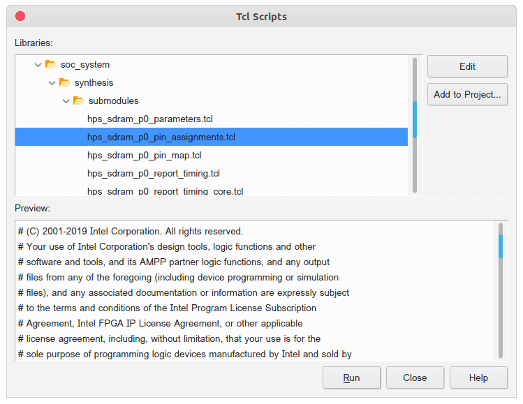

- Now you can compile the project like normal FPGA project
- Note that this step is automated in the Makefile. So you just need to run `make sof` to generate an sof file. The Makefile will run the TCL script automatically

## Step 14: Generating RBF
The ARM core has the ability to program the FPGA on boot. For this purpose, we need to convert our `sof` file to and `rbf` file. Which is just another format. Running `make rbf` will convert the `sof` to `rbf`.

## Step 15: Generating the PreLoader

### Boot Info

The boot flow of ARM is like this:

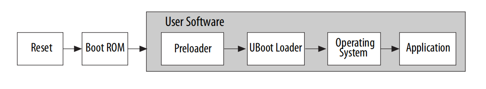

  - Reset precedes the boot stages and is an important part of device initialization. There are two different
  reset types: **cold reset** and **warm reset**. The boot process begins when the CPU in the MPU exits from the reset state. When the CPU exits from reset, it starts executing code at the reset exception address where the boot ROM code is located. With warm reset, some software registers are preserved and the boot process may skip some steps depending on software settings. In addition, on a warm reset, the preloader has the ability to be executed from on-chip RAM.

  - The boot ROM code is 64 KB in size and located in on-chip ROM at address range 0xFFFD0000 to 0xFFFDFFFF. The function of the boot ROM code is to determine the boot source, initialize the HPS after a reset, and jump to the preloader. 

  - The function of the preloader is user-defined. However, typical functions include:
    - Initializing SDRAM interface
    - Configuring HPS IO pins
    - Load the bootloader
  
  - UBoot is an open source bootloader that is used to load Linux. This step is optional since uBoot is not necessary for a baremetal application

  For complete technical details about the boot process, please refer to the Cyclone V HPS Technical Reference Manual.

### Preloader Generation

  - Altera provides a utility called `bsp-editor` which reads the HPS configuration from the Qsys design files and generates appropriate code in the preloader. This allows the preloader to configure the HPS as stated in the Qsys HPS component settings. To launch the `bsp-editor`, run the following in the embedded shell

    ```bash
    bsp-editor
    ```
    This will open the window

    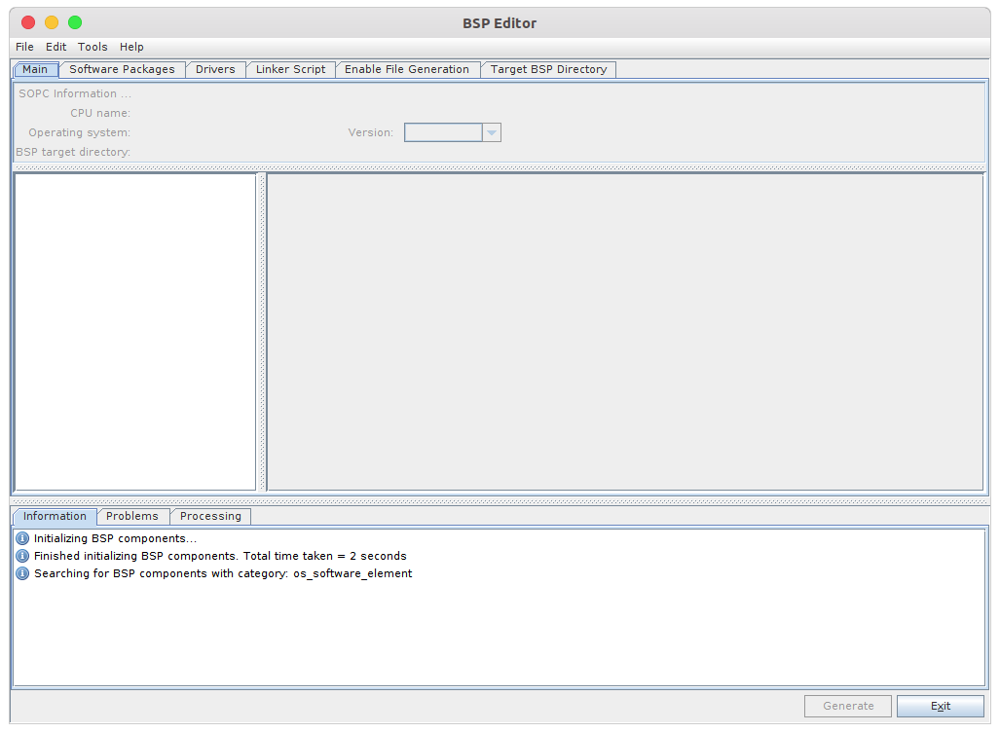

  - Go to `File > New HPS BSP` and set the settings according to the picture
    
    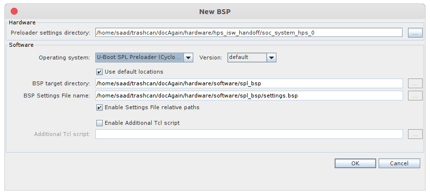

    In the `Preloader Settings Directory`, provide the path to `hps_isw_handoff/soc_system_hps_0` directory inside the quartus project folder. Click Ok

  - In the window that opens, there will be many settings. We need to modify only 1 of these: `spl.boot.fat_support`. This enables the FAT filesystem support. This is needed because the SDCARD containing the uboot image will be FAT formatted.

    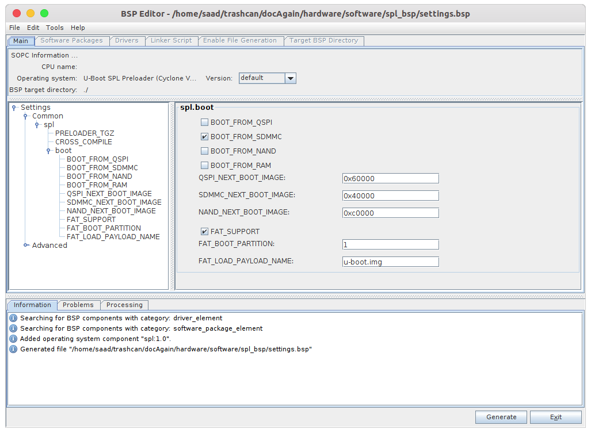

  - Click Generate to generate the preloader files and then exit.
  - Now go to the `software/spl_bsp` directory in the quartus project folder and run 

    ```bash
    make -j$(nproc)
    ```

    This will start compilation and fill the screen with lots of messages. In the end there should be no errors and the compilation will be successfull.
    